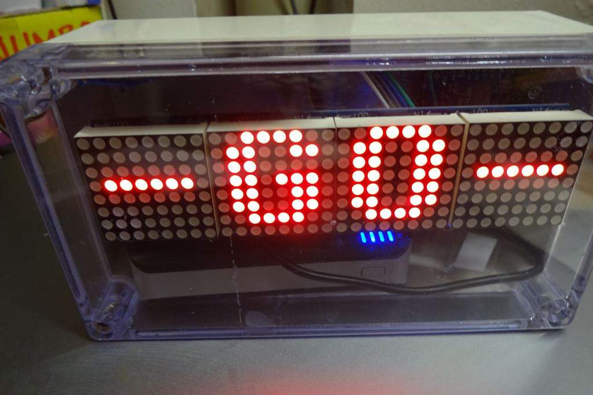
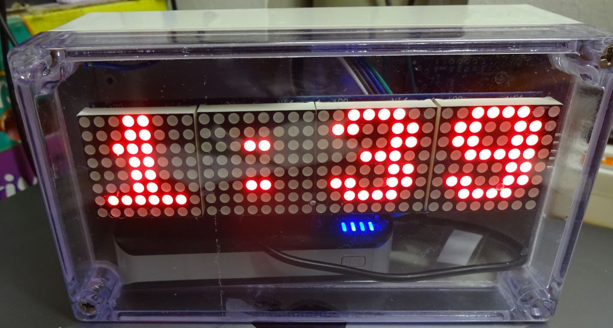

# Hundert auf Zwei
Schwimmuhr für unser Training bei [SG Elbe](https://sgelbe.de)

## Wozu eine Schwimmuhr?

Als Teil des Trainings der SG Elbe Masters schwimmen wir gerne "Hundert auf Zwei".

Dabei schwimmt man 100m, bei uns in Wedel sind das vier Bahnen, in einem Tempo, daß man gut 8-10 mal durchhalten kann.

Nach den 100m hat man dann solange Pause, wie noch bis zu den zwei Minuten übrig ist. Klar, wer etwas langsamer schwimmt muß mit weniger Pause auskommen, die Schnelleren können sich ein paar Sekunden länger ausruhen.

Schön herausfordernd und gar nicht so einfach, je mehr Strecke man macht! Wir kommen ganz gut mit 8-10 mal zurecht, aber wir wollen uns ja auch noch steigern :-)

## Anzeige

Die Schwimmuhr zeigt im Grunde _X_ mal die verstrichene Zeit in Sekunden an, von 0:01 bis 1:57. Die drei Sekunden vor dem ersten Start und dann vor den nächsten 100m werden besonders angezeigt, nämlich als Countdown 3,2,1 mit akustischem Signal. In der ersten Sekunde jedes 100m-2min-Blocks zeigt die Uhr "-GO-" an.

Als Anzeige kommt eine 4x8x8 LED-Matrix zum Einsatz. Die ist recht groß und hat den Vorteil, daß man die Zeit trotz Schwimmbrille schon von fast der Mitte der Bahn erkennen kann. Und gerade das kann man leider von der auf der "falschen Seite" der Halle an der Wand befindlichen vier-Zeiger-Schwimmuhr gerade nicht sagen!

## Bedienung

Die Uhr hat nur ein Bedienelement: einen berührungsempfindlichen Taster (Touch-Sensor), mit dem die Uhr gesteuert wird.

Nach dem Start zeigt die Uhr zunächst ein "Lebenszeichen":

> SG

> ELBE

> Hun-

> dert

> auf

> Zwei

Die Uhr wartet nun auf die Festlegung, **wie oft** denn nun die 100m geschwommen werden sollen. Dazu hält man eine Hand an den Touch-Sensor und wartet, bis die Anzeige der Reihe nach 4 bis 20 x 100m vorschlägt, in 2er-Schritten. Ist die gewünschte Zahl erreicht entfernt man die Hand schnell wieder.

> 4

> 6

> ...

> 20

Die gewählte Anzahl blinkt nun und mit einer **kurzen** Berührung des Sensors started der Spaß.

Die Uhr zählt nun 3, 2, 1 im Sekundentakt herunter und piept jeweils einmal kurz dabei. Auf der linken Seite wird die **verbleibende** 100m-Anzahl angezeigt.

> 4 3

> 4 2

> 4 1

Es geht los! Die Uhr zeigt

> -GO-

an und piept einmal lang. Dann werden die Minuten:Sekunden hochgezählt und im Format "0:01" bis "1:56" angezeigt.

> 0:01

> ...

> 1:56

Die letzten drei Sekunden jedes 100m-Blocks werden wieder als Countdown 3, 2, 1 angezeigt, mit der nun reduzierten **verbleibenden** 100m-Anzahl.

Alle geschafft? Am Ende bekommt ihr die Belohnung:

> SUPER!

blinkt eine halbe Minute lang, dann startet die Uhr neu und schaltet nach der Begrüßung die Anzeige ab, um (Batterie-) Strom zu sparen. Obwohl die Anzeige nun gerade nichts anzeigt, kann man nun erneut das Ganze mit der Auswahl der Anzahl wiederholen, siehe oben.

## Sonderfunktionen

Durch kurzes Berühren kann man während der Countdown-Phase zurück zur Auswahl der Anzahl kommen, falls man sich verwählt hat.

Durch längeres Berühren geht es gleich in die Auswahl mit 4, 6, 8, ...

Während der 100m-Blöcke kann man durch kurzes Berühren für eine Sekunde die Anzahl der verbleibenden 100m-Blöcke anzeigen.
Wenn man hier __länger__ drückt erscheint nach ein paar Sekunden

> OFF

und wenn man bei dieser Anzeige nun sofort die Hand wegnimmt setzt sich die Uhr zurück: Begrüßung, Anzeige leer und dann die Erwartung der Eingabe der Anzahl 4 ... 20.

# Ihr seid fitter?

Sonstige Einstellungen neben das Anzahl gibt es nicht. Insbesondere kann man **nicht** die Blocklänge von 2 Minuten verkürzen oder verlängern. Dazu muß der Source-Code geändert werden.

# Hardware

Die Uhr ist mit einem NanoPI NEO aufgebaut, an den per SPI eine 4x8x8-LED-Matrix angeschlossen ist.

Die Sensortaste ist mit einem TTP223 aufgebaut, da der NanoPI keine eingebauten HW-Touch-Funktion enthält.

Softwareseitig ist das Ganze mit einer kleinen State Machine und einem Ticker von 100ms-Raster gemacht. In MicroPython, weil da ziemlich knapp formuliert werden kann, es sehr einfach zu lesen und zu warten ist und halt gerade zur Hand war.

Eingabaut ist die Apparatur in ein verschraubtes ABS-Gehäuse mit transparentem Deckel und Dichtschnur, so daß die Uhr **wasserdicht** ist.

Daher auch die Bedienung per Touch, die durch das Gehäuse hindurch gut funktioniert, nachdem ich den Sensor mit einer kleinen innen ans Gehäuse geklebten Metallplatte  (35mmx50mm) verstärkt habe.

Infos zu der internen Verschaltung (Pins) finden sich im Source Code.
# Erweiterungen

Bis jetzt hat sich die Uhr in ein paar Tests ganz gut geschlagen.

Wünschenswert ist die Erweiterung um eine Echtzeituhr (DS3231, Library schon vorbereitet), so daß die Uhr auf Befehl oder einfach auch alle halbe Minute mal die aktuelle Zeit anzeigen könnte.

Sinnvoll wäre auch eine laufende Anzeige, wie lange das gesamte Training schon dauert (also nicht nur der 100m-Teil).

Schickt gerne Pull-Requests!

Als Stromversorgung ist zur Zeit eine USB-Powerbank mit im Gehäuse. Die scheint Saft für einige Trainings zu haben, selbst wenn der Microcontroller nicht wirklich "aus" ist. Solange die Anzeige leer ist sollte es erstmal ausreichend sein, wirkliche Low-Power-Settings im Controller sind nicht aktiviert.
Vorbereitet ist auch eine Versorgung per Batterie und Q-Charge (induktivem Laden), aber das ist noch nicht ausprobiert. Es könnte sein, daß die ABS-/PVC-Gehäuse zu dick für die Induktionsladung sind. Auch ist fraglich, ob eine kleine LiPo-Batterie mit Step-Up-Converter genug Power für die LEDs bietet.
# Viel Spaß!
